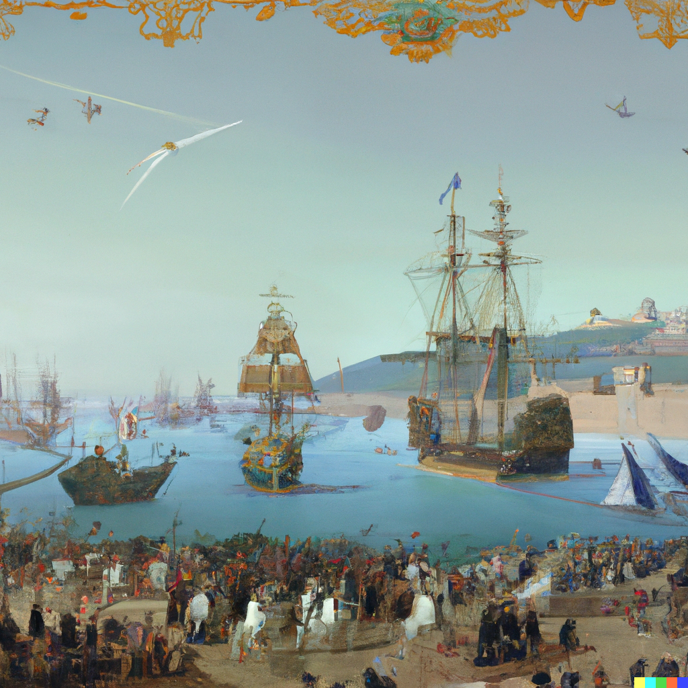

# OpenAI Dall-E 2

I was awarded access to the AI based image generation tool from OpenAI called Dall-E 2. 
It accepts as input detailed text and generates an image corresponding to the text. 
It is similar in spirit to OpenAI codex which accepts also a text string and generates code that is given in the query. 
As such, a new area of work called "prompt engineering" arose, which consists of finding the right prompt to generate the desired piece of code or the desired image.

For instance, I read an [article](https://gazeteoksijen.com/yazarlar/zulfu-livaneli/abdulhamidin-paris-macerasi-158546) by Zulfu Livaneli in the (Turkish) newspaper [Oksijen](https://gazeteoksijen.com) about a visit by Ottoman Sultan Abdulaziz to the French city of Toulon.

I thought the story was pretty interesting and tried to visualize how the visit must have taken place. (The article contains an [illlustration](https://i.gazeteoksijen.com/storage/files/images/2022/07/28/unnamed-pISy.jpg) of the emperor's being received in Paris but not with his fleet in Toulon). I wish there was some kind of news media that had filmed the event. 
So I tried various prompts to generate an image that reflects this historic visit. 
I came up with this:

The prompt was:

"a rendering of Ottoman Emperor Abdulaziz visiting France, arriving to Toulon with his fleet and being received by the French aristocracy".

Pretty interesting, isn't it?
